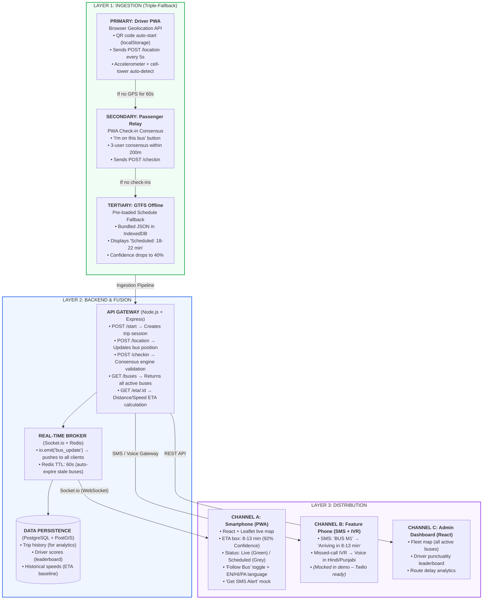

# BusMitra – Core Application Architecture

## Architecture Overview



```
┌─────────────────────────────────────────────────────────────────────────────┐
│                     BUSMITRA – APPLICATION ARCHITECTURE                     │
├─────────────────────────────────────────────────────────────────────────────┤
│                                                                             │
│  ┌───────────────────────────────────────────────────────────────────────┐  │
│  │                 LAYER 1: INGESTION (Triple-Fallback)                  │  │
│  ├───────────────────────────────────────────────────────────────────────┤  │
│  │                                                                       │  │
│  │    PRIMARY: Driver PWA (Browser Geolocation API)                      │  │
│  │    ┌─────────────────────────────────────────────────────────────┐    │  │
│  │    │  • QR code auto-start (localStorage)                        │    │  │
│  │    │  • Sends POST /location every 5 seconds                     │    │  │
│  │    │  • Accelerometer + cell-tower auto-detect                   │    │  │
│  │    └──────────────────────────────┬──────────────────────────────┘    │  │
│  │                                   │                                   │  │
│  │                                   ▼ (If no GPS for 60s)               │  │
│  │    SECONDARY: Passenger Relay (PWA Check-in)                          │  │
│  │    ┌─────────────────────────────────────────────────────────────┐    │  │
│  │    │  • "I'm on this bus" button                                 │    │  │
│  │    │  • 3-user consensus within 200m                             │    │  │
│  │    │  • Sends POST /checkin                                      │    │  │
│  │    └──────────────────────────────┬──────────────────────────────┘    │  │
│  │                                   │                                   │  │
│  │                                   ▼ (If no check-ins)                 │  │
│  │    TERTIARY: GTFS Offline (Pre-loaded Schedule)                       │  │
│  │    ┌─────────────────────────────────────────────────────────────┐    │  │
│  │    │  • Bundled JSON in PWA (IndexedDB)                          │    │  │
│  │    │  • Displays "Scheduled: 18-22 min"                          │    │  │
│  │    │  • Confidence drops to 40%                                  │    │  │
│  │    └─────────────────────────────────────────────────────────────┘    │  │
│  │                                                                       │  │
│  └───────────────────────────────────┬───────────────────────────────────┘  │
│                                      │                                      │
│                                      ▼                                      │
│  ┌───────────────────────────────────┴───────────────────────────────────┐  │
│  │                       LAYER 2: BACKEND & FUSION                       │  │
│  ├───────────────────────────────────────────────────────────────────────┤  │
│  │                                                                       │  │
│  │    API GATEWAY (Node.js + Express)                                    │  │
│  │    ┌─────────────────────────────────────────────────────────────┐    │  │
│  │    │  POST /start    → Creates trip session                      │    │  │
│  │    │  POST /location → Updates bus position (Redis cache)        │    │  │
│  │    │  POST /checkin  → Consensus engine validation               │    │  │
│  │    │  GET  /buses    → Returns all active buses                  │    │  │
│  │    │  GET  /eta/:id  → Distance/Speed ETA calculation            │    │  │
│  │    └──────────────────────────────┬──────────────────────────────┘    │  │
│  │                                   │                                   │  │
│  │    ┌──────────────────────────────┴──────────────────────────────┐    │  │
│  │    │  REAL-TIME BROKER (Socket.io + Redis)                       │    │  │
│  │    │  • io.emit('bus_update') → pushes to all clients            │    │  │
│  │    │  • Redis TTL: 60s (auto-expire stale buses)                 │    │  │
│  │    └──────────────────────────────┬──────────────────────────────┘    │  │
│  │                                   │                                   │  │
│  │    ┌──────────────────────────────┴──────────────────────────────┐    │  │
│  │    │  DATA PERSISTENCE (PostgreSQL + PostGIS)                    │    │  │
│  │    │  • Trip history (for analytics)                             │    │  │
│  │    │  • Driver scores (leaderboard)                              │    │  │
│  │    │  • Historical speeds (ETA baseline)                         │    │  │
│  │    └─────────────────────────────────────────────────────────────┘    │  │
│  │                                                                       │  │
│  └───────────────────────────────────┬───────────────────────────────────┘  │
│                                      │                                      │
│                                      ▼                                      │
│  ┌───────────────────────────────────┴───────────────────────────────────┐  │
│  │                         LAYER 3: DISTRIBUTION                         │  │
│  ├───────────────────────────────────────────────────────────────────────┤  │
│  │                                                                       │  │
│  │    CHANNEL A: Smartphone (PWA – React + Leaflet)                      │  │
│  │    ┌─────────────────────────────────────────────────────────────┐    │  │
│  │    │  • Live map with moving bus marker                          │    │  │
│  │    │  • ETA box: "8-13 min | 92% Confidence"                     │    │  │
│  │    │  • Status: Green (Live) / Grey (Scheduled)                  │    │  │
│  │    │  • "Follow Bus" toggle (auto-center)                        │    │  │
│  │    │  • Language toggle (EN/HI/PA)                               │    │  │
│  │    │  • "Get SMS Alert" mock                                     │    │  │
│  │    └─────────────────────────────────────────────────────────────┘    │  │
│  │                                                                       │  │
│  │    CHANNEL B: Feature Phone (SMS + IVR)                               │  │
│  │    ┌─────────────────────────────────────────────────────────────┐    │  │
│  │    │  • SMS: "BUS M1" → "Arriving in 8-13 min"                   │    │  │
│  │    │  • Missed-call IVR → Voice in Hindi/Punjabi                 │    │  │
│  │    │  • *(Mocked in demo – Twilio ready for production)*         │    │  │
│  │    └─────────────────────────────────────────────────────────────┘    │  │
│  │                                                                       │  │
│  │    CHANNEL C: Admin Dashboard (React)                                 │  │
│  │    ┌─────────────────────────────────────────────────────────────┐    │  │
│  │    │  • Fleet map (all buses)                                    │    │  │
│  │    │  • Driver leaderboard                                       │    │  │
│  │    │  • Route delay analytics                                    │    │  │
│  │    └─────────────────────────────────────────────────────────────┘    │  │
│  │                                                                       │  │
│  └───────────────────────────────────────────────────────────────────────┘  │
│                                                                             │
└─────────────────────────────────────────────────────────────────────────────┘
```

## Application Flow

| Step | Component | Action |
|------|-----------|--------|
| 1 | Driver PWA | Scans QR, starts trip |
| 2 | Driver PWA | Sends GPS every 5s |
| 3 | Backend | Stores location in Redis |
| 4 | Backend | Emits Socket.io event |
| 5 | Passenger PWA | Receives event, moves marker |
| 6 | Passenger PWA | Polls /eta every 5s |
| 7 | Backend | Calculates ETA using distance/speed |
| 8 | Passenger PWA | Displays "8-13 min | 92%" |

## Technology Stack

| Layer | Technology |
|-------|------------|
| Frontend (PWA) | React + Vite + Tailwind |
| Map | Leaflet + OpenStreetMap |
| Backend | Node.js + Express |
| Real-Time | Socket.io |
| Cache | Redis |
| Database | PostgreSQL + PostGIS |
| Deployment | Render (Backend) + Vercel (Frontend) |
