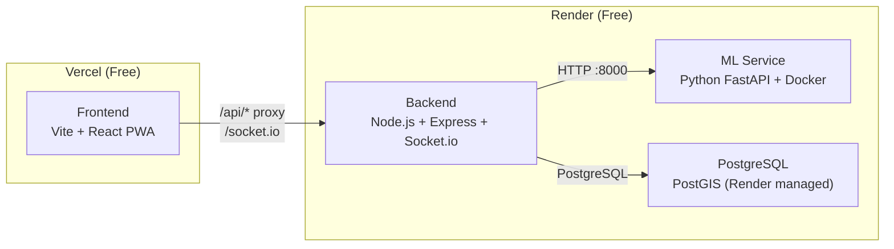

# Deploy BusMitra — Render + Vercel

Deploy the full BusMitra stack to free-tier cloud services so judges can access it from any device.

## Architecture



## Proposed Changes

### Backend — Render Web Service

#### [NEW] [render.yaml](file:///c:/Users/PRIYA SHARMA/Downloads/BusMitra/BusMitra/render.yaml)
Render Blueprint (Infrastructure-as-Code) defining all 3 Render services:
- **busmitra-backend**: Node.js web service from `backend/` directory
- **busmitra-ml**: Docker web service from `ml-service/` directory
- **busmitra-db**: Managed PostgreSQL instance (free tier)

#### [NEW] [backend/Dockerfile](file:///c:/Users/PRIYA SHARMA/Downloads/BusMitra/BusMitra/backend/Dockerfile)
Dockerize the backend so Render can build it. Copies `data/` directory (routes.json, stops.json, gtfs.json, delays.json) into the image since the backend reads them at startup.

#### [MODIFY] [server.js](file:///c:/Users/PRIYA SHARMA/Downloads/BusMitra/BusMitra/backend/src/server.js)
- Serve the Vite-built frontend static files in production (so we could also deploy as a single service if needed)
- Add `NODE_ENV` detection

---

### Frontend — Vercel

#### [NEW] [frontend/vercel.json](file:///c:/Users/PRIYA SHARMA/Downloads/BusMitra/BusMitra/frontend/vercel.json)
- Rewrites `/api/*` and `/socket.io/*` to the Render backend URL
- SPA fallback for React Router (all routes → `index.html`)

#### [MODIFY] [useBusStore.js](file:///c:/Users/PRIYA SHARMA/Downloads/BusMitra/BusMitra/frontend/src/store/useBusStore.js)
- Make Socket.io connection point to the production backend URL via `VITE_BACKEND_URL` env var (currently connects to `'/'` which only works with Vite dev proxy)

#### [NEW] [frontend/.env.production](file:///c:/Users/PRIYA SHARMA/Downloads/BusMitra/BusMitra/frontend/.env.production)
- `VITE_BACKEND_URL` — will be set to the Render backend URL after first deploy

---

### ML Service — Render Docker Service

#### [MODIFY] [ml-service/Dockerfile](file:///c:/Users/PRIYA SHARMA/Downloads/BusMitra/BusMitra/ml-service/Dockerfile)
- Already has a working Dockerfile. Just needs the `render.yaml` to reference it.

---

### Database — Render Managed PostgreSQL

#### [NEW] [backend/scripts/init-render-db.sql](file:///c:/Users/PRIYA SHARMA/Downloads/BusMitra/BusMitra/backend/scripts/init-render-db.sql)
- Combines `db/init/01-schema.sql` and `02-seed.sql` into a single script to run on the managed PostgreSQL instance (Render's managed DB doesn't run Docker init scripts)

---

### Gitignore & Env

#### [MODIFY] [.gitignore](file:///c:/Users/PRIYA SHARMA/Downloads/BusMitra/BusMitra/.gitignore)
- Add `.env.local`, `.env.production.local`, `.vercel/`

---

## Environment Variables

### Render Backend
| Variable | Value |
|---|---|
| `PORT` | Set automatically by Render |
| `DATABASE_URL` | Set automatically by Render (linked to managed PostgreSQL) |
| `ML_SERVICE_URL` | Internal URL of the ML service (e.g., `http://busmitra-ml:8000` or Render's internal DNS) |
| `NODE_ENV` | `production` |

### Render ML Service
| Variable | Value |
|---|---|
| `PORT` | `8000` |

### Vercel Frontend
| Variable | Value |
|---|---|
| `VITE_BACKEND_URL` | `https://busmitra-backend.onrender.com` (set after backend deploys) |

## User Review Required

> [!IMPORTANT]
> **Render free tier has cold starts.** The backend spins down after 15 min of inactivity and takes ~30–50 seconds to restart. During a hackathon demo, hit the URL 1 minute before presenting to "warm it up". The ML service (Docker) has the same behavior.

> [!IMPORTANT]
> **Render free PostgreSQL expires after 90 days.** Fine for hackathon. It also doesn't have PostGIS extension — the DB service queries will gracefully degrade (the `postgis_full_version()` call in the health check will error, but we'll handle it). The app's core functionality uses in-memory cache, not DB queries.

> [!WARNING]
> **Socket.io over Vercel rewrites has limitations.** Vercel rewrites work for HTTP requests but WebSocket upgrades through Vercel's edge proxy can be unreliable. The fix: Socket.io in the frontend will connect **directly** to the Render backend URL (not via Vercel proxy), so WebSockets bypass Vercel entirely.

## Verification Plan

### Automated Tests
```bash
# After deploy, verify all endpoints:
curl https://busmitra-backend.onrender.com/health
curl https://busmitra-backend.onrender.com/api/buses
curl https://busmitra-backend.onrender.com/api/routes
curl -X POST https://busmitra-backend.onrender.com/api/sms-webhook -H "Content-Type: application/json" -d '{"from": "9876543210", "body": "BUS M1"}'

# ML service
curl https://busmitra-ml.onrender.com/health
curl "https://busmitra-ml.onrender.com/predict-eta?bus_id=M1"

# Frontend
# Open https://busmitra.vercel.app/ in browser
```

### Manual Verification
- Open the Vercel URL on a phone → check PWA install prompt
- Verify map loads, bus icons display
- Run simulator locally pointing to the Render backend: `BACKEND_URL=https://busmitra-backend.onrender.com node simulator/index.js`
